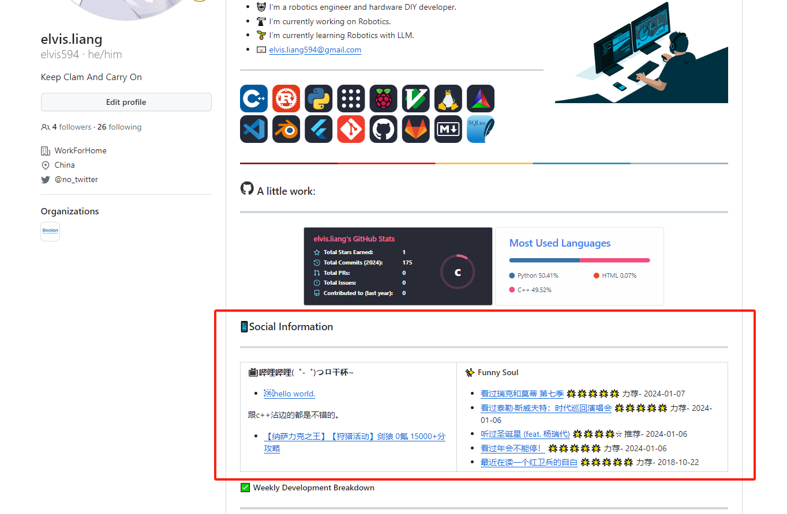
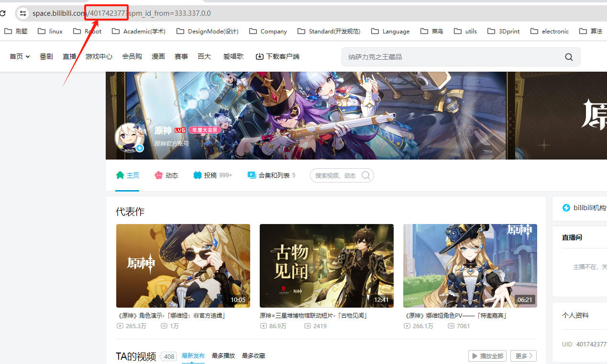

# social-readme
> 利用github action自动把个人的社交动态信息更新到github profile readme.

[English](./README.md)

[![zhihulink][zhihu-badge]][zhihu-link]
[![bilibili-link][bilibili-badge]][bilibili-link]
[![leetcode-link][leetcode-badge]][leetcode-link]



## 当前功能
- 支持豆瓣评分
- 支持RSS_hub
- 支持哔哩哔哩个人动态

## 使用指南

### 1. 使用Github Action
- 个人profile仓库下构建.github/workflows/social-readme.yml
> 怎么使用github action? [看这里](https://docs.github.com/en/actions/learn-github-actions/introduction-to-github-actions)

复制下面的这内容到仓库里。
```yml
name: Social Readme
run-name: update Social Readme 🚀
on:
  schedule:
    - cron: '0 0 * * *'
  workflow_dispatch:

jobs:
  update-social:
    runs-on: ubuntu-latest
    steps:
      - uses: elvis594/social-readme@master
        with:
          douban_id: '1234' //填上你的豆瓣id
          bilibili_id: '1234' // 填上你的哔哩哔哩id 也就是uid号
```
### 2. 修改仓库权限
- 修改github Actions的权限,让他具有读写的权限。

- 添加github token
    - 生成一个新的token
    - 添加到仓库的secrets中
    - 修改social-readme.yml中的token


### 3. 找到你的社交账号id
**例子：bilibili**
- 打开原神的个人主页
    

- 找到ID，方框圈起来这里。
- 填入到github action的配置文件中 (social-readme.yml)

### 4. 生成你的社交readme
- 在你的profile仓库下创建README.md
- 需要在Readme.md中添加相对应的索引标签
  
豆瓣：
```markdown
<!-- START_SECTION:douban -->
<!-- END_SECTION:douban -->
```

哔哩哔哩：
```markdown
<!-- START_SECTION:bilibili -->
<!-- END_SECTION:bilibili -->
```

## 更多可选配置
```yml

jobs:
  update-social:
    runs-on: ubuntu-latest
    steps:
      - uses: elvis594/social-readme@master
        with:
          douban_id: '1234' //填上你的豆瓣id
          bilibili_id: '1234' // 填上你的哔哩哔哩id 也就是uid号

          douban_limit: 10 // 豆瓣评分显示的数量 默认5
          bilibili_limit: 10 // 豆瓣评分显示的数量 默认5
          rss_hub_link: 'https://rsshub.app' // rss_hub的链接 默认https://rss.shab.fun
```

## Meta

elvis – [@Bilibili][bilibili-link] – elvis.liang594@gmail.com

Distributed under the MIT license. See ``LICENSE`` for more information.

[https://github.com/elvis594](https://github.com/elvis594)

<!-- Markdown link & img dfn's -->
[zhihu-badge]: https://img.shields.io/badge/-@Elvis-1ca0f1?style=flat-square&labelColor=1ca0f1&logo=Zhihu&logoColor=white&link=https://www.zhihu.com/people/594-26
[zhihu-link]:https://www.zhihu.com/people/594-26

[bilibili-badge]: https://img.shields.io/badge/-Bilibili-pink?style=flat-square&logo=bilibili&logoColor=#00A1D

[bilibili-link]:https://space.bilibili.com/1802901?spm_id_from=333.1007.0.0

[leetcode-badge]:https://img.shields.io/badge/-Leetcode-black?style=flat-square&logo=Leetcode&logoColor=#FFA116/
[leetcode-link]:https://leetcode.cn/u/_elvis/

